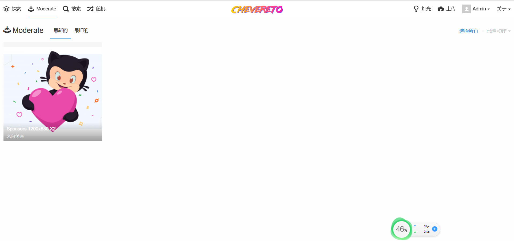
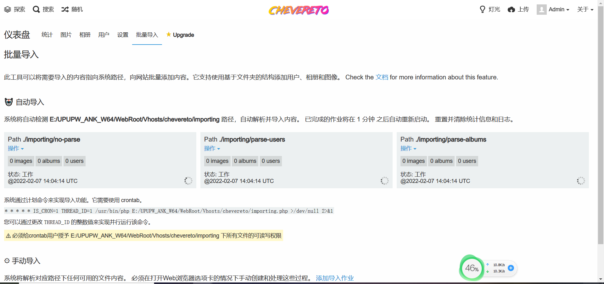
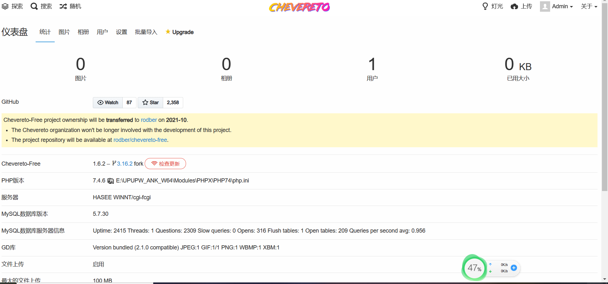

# Chevereto-Free-Multi-Language

Chevereto-Free允许你在你自己的服务器上创建一个全功能的多语言图像托管网站。这是你的主机和你的规则，告别关闭和限制。

## ✨ 截图

## 🦓 关于本 fork

Chevereto-Free-Multi-Language 是 [Chevereto-Free](https://github.com/rodber/chevereto-free/)的一个Fork，其中只保留了基本的功能。Chevereto-Free适用于个人使用和小型社区。

👉 **本fork相比源fork的变化**

* 撤销 "删除多语言支持"
* 撤销 "删除审定"
* 撤销 "删除批量导入内容"

## 🧐 需求

* PHP 7.4
* MySQL 5.7 / 8 - MariaDB 10
* Apache HTTP Web Server
  * mod_rewrite

## 📚 文档

[chevereto-free.github.io](https://chevereto-free.github.io)

## 📜 许可证

Copyright [Rodolfo Berríos Arce](http://rodolfoberrios.com) - [AGPLv3](LICENSE).
